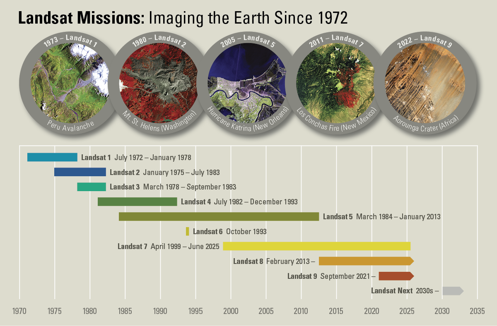
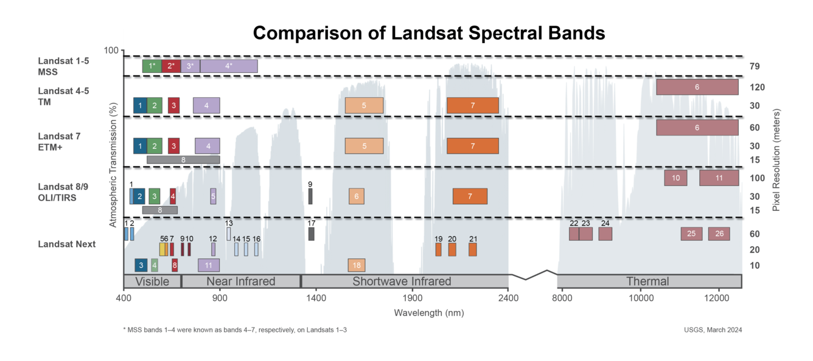
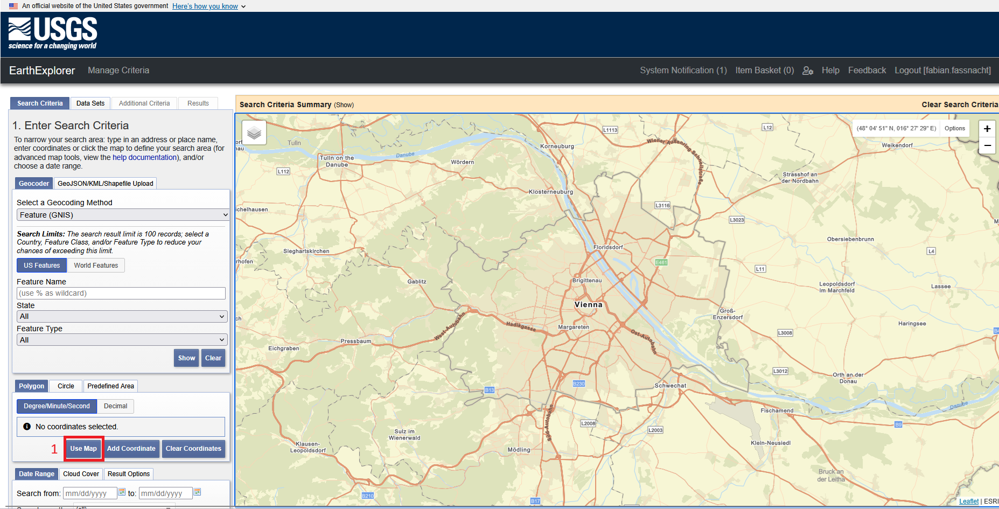
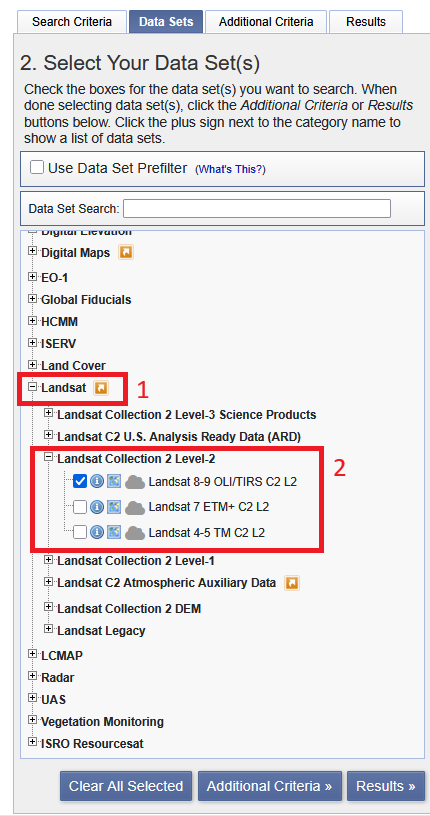
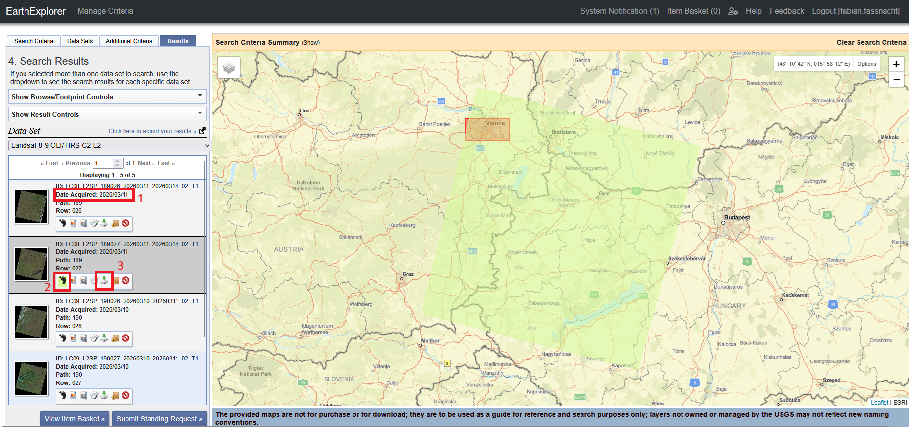
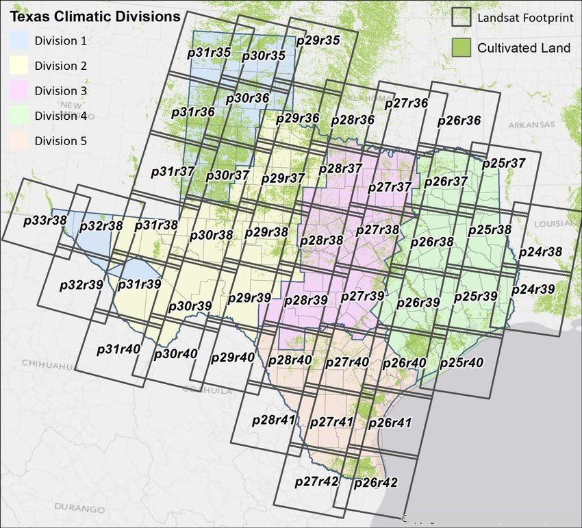
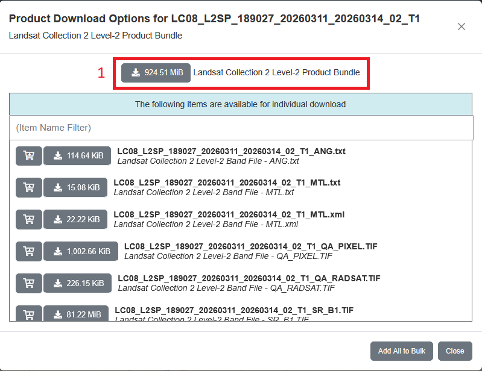


Fernerkundung in der Landschaftsplanung - Tag 3 - Download von Landsat Daten via USGS Earth Explorer

**Autoren:** Dieses Tutorial wurde von Fabian Fassnacht entwickelt.

## 3 Download von Landsat Daten

### 3.1 Lernziele

• Kennenlernen des USGS Earth Explorers

• Erlangung der Fähigkeit Landsat-Daten zu finden und herunterzuladen

• Verständnis für das Landsat-eigene Path und Row-System entwickeln

### 3.2 Die Landsat-Satelliten
Die vom United States Geological Survey (USGS) betriebene Website Earth Explorer bietet eine sehr umfangreiche Sammlung an Fernerkundungsdaten, die frei heruntergeladen werden können. In diesem Tutorial werden wir uns insbesondere mit Landsat-Daten beschäftigen. Landsat 1 war der erste Erdbeobachtungssatellit, der für rein zivile Anwendungen und mit einem Schwerpunkt auf Umweltmonitoring entwickelt wurde. Seit dem Start des ersten Landsat-Satelliten im Jahr 1972 liegt eine kontinuierliche Zeitserie an Landsat-Daten bis heute vor (Abbildung 1).

 

**Abbildung 1: Zeitliche Übersicht über die Landsat-Sensoren - Bildquelle: Offizielle Webseite des USGS**

Dabei haben sich die technischen Spezifikationen des Sensors kontinuerlich verbessert - es wurde aber gleichzeitig auch auf eine möglichst gute Kontinuität der Zeitserien geachtet. Ab dem Jahr 1984 mit dem Start von Landsat 4 wurden Daten mit einer räumlichen Auflösung (Pixelgröße) von 30 m und 6 Spektralkanälen im visuellen und Infrarotbereich (blaues, grünes, rotes Licht, nahres Infrarot, kurwelliges Infrarot 1 und kurzwelliges Infrarot 2; auf englisch: blue, green, red, near infrared (NIR), shortwave infrared 1 (SWIR1), shortwave infrared 2 (SWIR2)) gesammelt (Abbildung 2). Dazu kamen ab Landsat 4 auch noch 1 bzw. später 2 Spektralkanäle im thermalen Infrarot.

Es ist **sehr wichtig zu wissen welche Bänder welchen Wellenlängenbereichen entsprechen** (siehe Abbildung 2). Bitte unbedingt auch darauf achten, dass sich die Namen der Bänder zum Teil zwischen den Landsat-Sensoren unterscheiden.

 

**Abbildung 2: Übersicht über die Spektralkanäle der Landsat-Satelliten - Bildquelle: Offizielle Webseite des USGS**

 
### 3.3 Download von Landsat-Satellitendaten via EarthExplorer

Die Downloadseite für Landsat-Satellitebilder findet sich unter dem Link: 

https://earthexplorer.usgs.gov/

Bitte rufen Sie den Link auf und registrieren Sie sich auf dem Portal indem Sie zuerst auf "Login" klicken (markiert mit 1 in Abbildung 3) und dann im erscheinenden Dialog "Create New Account" klicken. Bitte folgen Sie den Anweisungen und registrieren Sie sich und loggen Sie sich danach ein. Nur nach dem Login kann ein Download von Daten erfolgen.

**Abbildung 3: Ansicht des USGS Earth Explorers.**

Nach dem erfolgreichen Login, werden wir nun ein aktuelles Satellitenbild von Wien herunterladen.

Dafür nutzen wir die "pan"-Funktion (links-klick und ziehen) sowie das Mausrad (für die Zoom-Funktion) um auf der Karte rechts in der Benutzeroberfläche der Webseite nach Wien zu navigieren (Abbildung 4).

**Abbildung 4: Ansicht des USGS Earth Explorers mit Wien im aktuellen Kartenausschnitt.**

Nun können wir das aktuelle dargestellte Gebiet als Untersuchungsgebiet wählen in dem wir auf den Button "Use Map" klicken (Markiert mit 1 in Abbildung 4). Daraufhin wird ein Polygon erstellt, welches dem aktuell dargestellten Kartenausschnitt entspricht.

**Abbildung 5: Ansicht des USGS Earth Explorers mit Polygon des ausgewählten Kartenausschnitts**

Wenn wir etwas herauszoomen, können wir das Polygon (Abbildung 5) gut erkennen und gegebenenfalls auch anpassen, indem wir die Markierungen via drag & drop verschieben.
 
 Als nächsten Schritt wählen wir den Zeitraum für den wir Daten suchen möchten. Hierzu wählen wir ein Start- und ein Enddatum in der entsprechenden Eingabezeile aus (markiert mit 1 in Abbildung 5). In unserem Fall wählen wir den Zeitraum vom 1. Februar 2026 bis zum heutigen Tag (in meinem Fall der 20. März 2026). Anschließend klicken wir auf den Reiter **"Cloud Cover"** (markiert mit 2 in Abbildung 5) und wählen eine maximale Wolkenbedeckung von 30% aus. 

Nun sind wir bereit, die von uns präfierierten Sensoren auszuwählen. Hierfür klicken wir auf "Data Sets >>" (markiert mit 3 in Abbildung 5).

In dem neu erscheinenden Menü können wir nun zuerst **"Landsat"** auswählen (markiert mit 1 in Abbildung 6) und danach **"Landsat Collection 2 Level 2"** (markiert mit 2 in Abbildung 6) und schließlich setzen wir ein Häkchen bei **"Landsat 8-9 OLI/TIRS C2L2"** um nur nach Daten von den zwei neusten Landsat-Satelliten zu suchen (markiert mit 3 in Abbildung 5). Wir bestätigen in dem wir auf **"Results >>"** klicken.

**Abbildung 6: Auswahl der Datenprodukte**

Daraufhin sollten in der linken Leiste, alle Landsat-8 und -9 Satellitenbilder dargestellt werden, welche eine Wolkenbedeckung unter 30% haben und in den definierten Aufnahmezeitraum fallen sowie eine Überschneidung mit dem definierten Zielgebiet aufweisen. In den hier ausgewählten Settings führt dies zu fünf Treffern (zwei Landsat 8 und drei Landsat 9 Szenen) (Abbildung 7). Für jeden Treffer ist das Aufnahmedatum dargestellt (markiert mit 1 in Abbildung 7). Die Zahl der Treffer kann abweichen, wenn das Untersuchungsgebiet anders definiert wurde oder die sonstigen Einstellungen abweichen.

**Abbildung 7: Gefundene Landsat-Szenen, die den Anforderungen entsprechen**

In den kleinen Previews links kann man bereits erkennen, dass nicht alle Szenen genau dieselbe Fläche abbilden. Wenn wir sehen wollen welches Gebiet genau von den jeweiligen Satellitenbildern abgedeckt wird, können wir auf das kleine **"Footprint"**-Symbol klicken (markiert mit 2 in Abbildung 7). Der vom Satellitenbild abgedeckte Bereich wird dann rechts im Fenster dargestellt. In Abbildung 7 haben alle vier dargestellten Treffer eine andere räumliche Abdeckung. Dies kann man unter anderem daran erkennen, dass sich die **"Path"** und **"Row"** Werte aller dargestellten Treffer unterscheiden (markiert mit 4 in Abbildung 7).

Die **"Path and Row"** Information kann sehr hilfreich sein, wenn man z.B. eine Veränderungsanalyse mit Landsatdaten durchführen möchte. Konkret steht **"Path"** für den jeweiligen Orbit auf dem das Sallitenbild aufgenommen wurde und **"Row"** steht für eine eine durch das USGS definierte Unterteilung der kontinuerlich aufgenommenen Orbite in Ost-West-Richtung um die jeweiligen Satellitenbilder in einer Standart-Kachelgröße bereitzustellen. Im Prinzip nimmt der Satellite durchgehend lange Bildstreifen auf, die dann danach in "row-Richtung" abgeschnitten werden, um kleinere Datenhäppchen bereitstellen zu können. Die Path and Row Werte sind für alle Landsat-Sensoren nahezu identisch und können auch verwendet werden, um nach Satellitenbildern zu suchen, die jeweils im selben Orbit und in der selben row aufgenommen wurden (aber zu unterschiedlichen Zeitpunkten). Dafür gibt es in der Suchmaske auch eine Funktion. Als zusätzliche Veranschaulichung der System zeigt Abbildung 8 die jeweiligen Path und Row Kombinationen, die den Bundesstaat Texas abdecken

**Abbildung 8: Das Path und Row System für Texas** (Bildquelle: https://www.researchgate.net/publication/323838161/figure/fig2/AS:614403611320320@1523496644037/Landsat-World-Reference-System-2-WRS-2-path-and-row-overlay-for-Texas-in-relation-to.png)

Zum Schluss wählen wir nun eine der gefunden Szenen aus und laden Sie herunter. Hierfür drücken wir auf den Download-Button (markiert mit 3 in Abbildung 7). Daraufhin öffnet sich ein neues Fenster in welchem wir dann auf den Button "Product Options" klicken (markiert mit 1 in Abbildung 9) 

**Abbildung 9: Download der gewählten Landsat-Szene Teil 1**

In dem wiederum neu erscheinenden Fenster klicken wir nun auf das ganz oben dargestellte Produkt-Bundle (markiert mit in 1 in Abbildung 10). Nun sollte der Download einer gepackten Datei starten.

**Abbildung 10: Download der gewählten Landsat-Szene Teil 2**

Bitte darauf achten das Bild an einem Ort zu speichern, den Sie wiederfinden können.

Sollte der Download-Button ausgegraut sein, so liegt dies höchstwahrscheinlich daran, dass man noch nicht eingeloggt ist.

Das waren die Inhalte des Tutorials zum Download von Landsat-Daten.
Wenn Sie dieses Tutorial durchgearbeitet haben, haben Sie

✓ das USGS Earth Explorer Portal kennengelernt,
✓ sich damit beschäftigt, wie Sie Landsatdaten vom USGS Earth Explorer Portal herunterladen können
✓ das Path und Row System von Landsat kennengelernt

